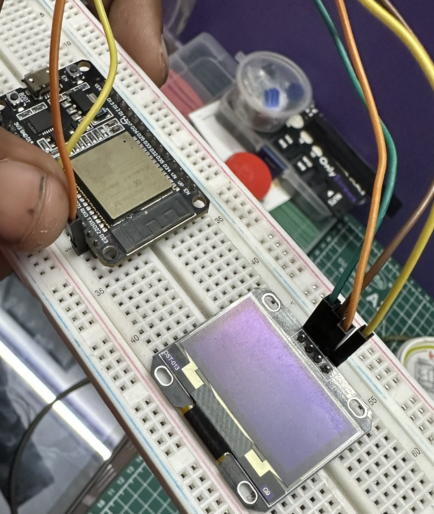
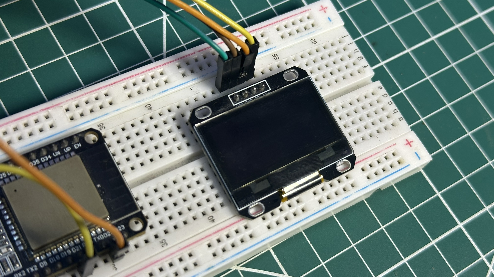
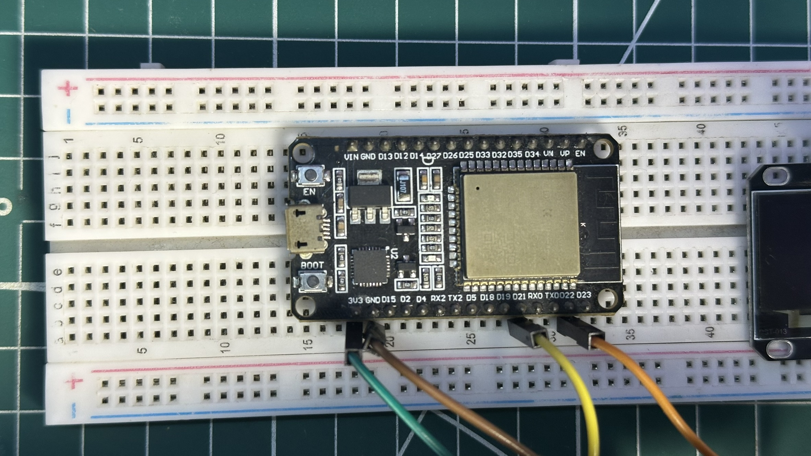
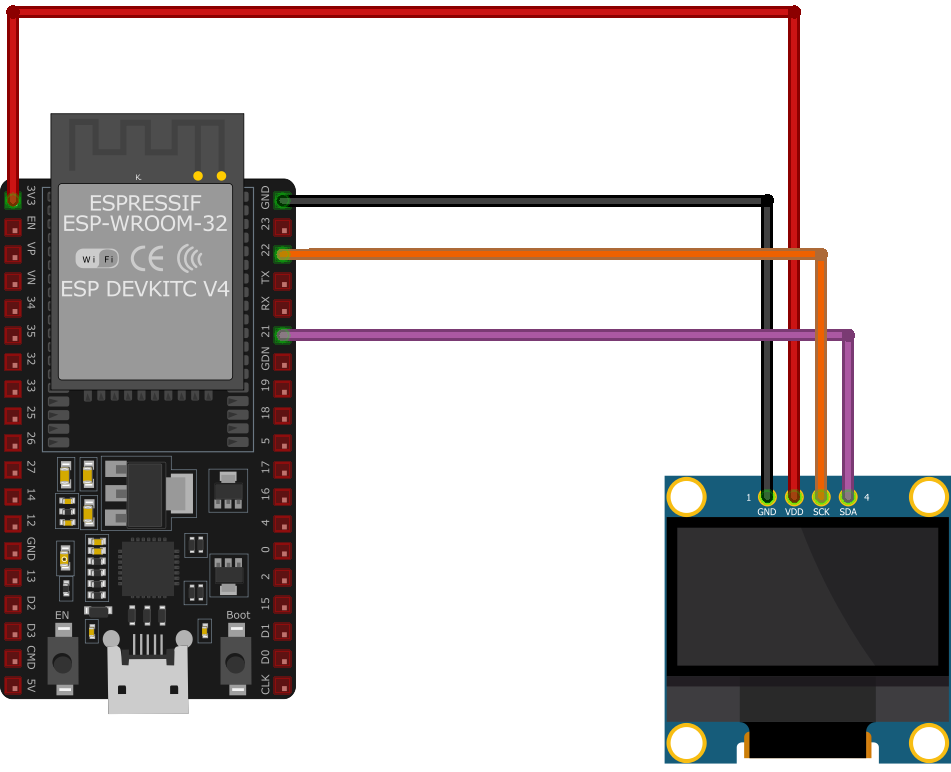

# ESP32 OLED Animation (SSD1306 / SSD1106 | Arduino | I2C Display)

ESP32 OLED animation project using SSD1306/SSD1106 display.  
Smooth frame-based animation on 128x64 OLED.
##  Quick Navigation

- [Preview](#-preview)
- [Hardware Setup](#-hardware-setup)
- [Wiring](#-wiring-i2c)
- [Features](#-features)
- [How to Run](#-how-to-run)
- [Notes](#-notes)

---

## 📸 Preview

  

---

## 🔧 Hardware Setup

  

---

## 📟 OLED Close-up

  

---

## ⚙️ ESP32 Board

  

---

## 🛠 Hardware Used
- ESP32 Dev Board
- OLED Display (SSD1306 / SSD1106)
- Breadboard
- Jumper wires

---

## 🔌 Wiring (I2C)

| OLED | ESP32 |
|------|------|
| VCC  | 3.3V |
| GND  | GND  |
| SDA  | GPIO 21 |
| SCL  | GPIO 22 |
</td> <td>  </td> </tr>

---

## 📁 Project Structure

- `/SSD1306` → Code for SSD1306  
- `/SSD1106` → Code for SSD1106  

---

## ⚡ Features
- Smooth animation playback  
- Frame-based rendering  
- Lightweight & optimized  

---

## 🚀 How to Run
1. Install libraries:
   - Adafruit GFX  
   - Adafruit SSD1306  
   - U8g2 (for SSD1106)

2. Upload code from respective folder  

3. Enjoy 😎  

---

## 📌 Notes
- SSD1106 uses U8g2  
- Adjust delay for FPS tuning  

---
🔍 Keywords

- ESP32 OLED animation  
- SSD1306 project  
- SSD1106 display  
- Arduino ESP32  
- OLED animation code  
- I2C display ESP32  
- embedded systems project  
- ESP32 graphics  
- DIY electronics  
- microcontroller projects 
---

  Made with ❤️ by <b>Surya S</b> 
  Follow on Instagram: <a href="https://instagram.com/sparky.fpv">@sparky.fpv</a>

